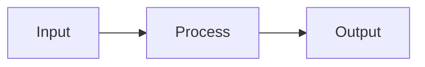

# Spec-Kit Utilization Plan

**Date**: 2025-10-20
**Purpose**: Leverage spec-kit for better project structure and code generation

## 🎯 Current State

The project has spec-kit configured but **not actively utilized**:
- ✅ Configuration exists in `.lablab-bean.yaml`
- ✅ Taskfile has `speck-init` and `speck-generate` tasks
- ❌ No templates directory (`./templates`)
- ❌ No generated code directory (`./generated`)
- ❌ No actual template files
- ❌ Empty specs directory (`docs/specs/.gitkeep`)

## 📋 Recommended Utilization Strategy

### 1. **Specification Documentation** 

Use `docs/specs/` to maintain formal specifications for:

#### Game Systems
- `docs/specs/dungeon-generation.md` - Dungeon generation algorithm spec
- `docs/specs/combat-system.md` - Combat mechanics specification
- `docs/specs/entity-system.md` - Entity component system spec
- `docs/specs/fog-of-war.md` - Visibility and FOV specification
- `docs/specs/monster-ai.md` - Monster behavior specification

#### Architecture
- `docs/specs/rendering-pipeline.md` - Terminal.Gui rendering spec
- `docs/specs/web-terminal.md` - Web terminal integration spec
- `docs/specs/game-state.md` - Game state management spec

#### API Contracts
- `docs/specs/terminal-api.md` - Terminal WebSocket API
- `docs/specs/game-events.md` - Event system specification

**Benefits**:
- Single source of truth for behavior
- Easier onboarding for new developers
- Better change management
- Documentation stays in sync with code

### 2. **Code Generation Templates**

Create templates for common patterns in the project:

#### Entity Templates
```
templates/
├── entity/
│   ├── monster.tmpl          # Monster entity template
│   ├── item.tmpl             # Item entity template
│   └── player-class.tmpl     # Player class template
```

**Example usage**:
```bash
task speck-generate TEMPLATE=entity/monster OUTPUT=dragon.cs
# Generates: generated/dragon.cs with boilerplate
```

#### Service Templates
```
templates/
├── service/
│   ├── game-service.tmpl     # Game service template
│   ├── ui-service.tmpl       # UI service template
│   └── manager.tmpl          # Manager class template
```

#### Test Templates
```
templates/
├── test/
│   ├── unit-test.tmpl        # xUnit test template
│   └── integration-test.tmpl # Integration test template
```

### 3. **Document Generation**

Generate consistent documentation from specs:

```
templates/
├── docs/
│   ├── feature-spec.tmpl     # Feature specification template
│   ├── api-doc.tmpl          # API documentation template
│   ├── changelog-entry.tmpl  # Changelog entry template
│   └── release-notes.tmpl    # Release notes template
```

**Example**:
```bash
task speck-generate TEMPLATE=docs/feature-spec OUTPUT=new-feature.md
```

### 4. **Configuration Templates**

Generate configuration files:

```
templates/
├── config/
│   ├── ecosystem.tmpl        # PM2 ecosystem config
│   ├── github-workflow.tmpl  # GitHub Actions workflow
│   └── docker-compose.tmpl   # Docker compose file
```

## 🏗️ Implementation Plan

### Phase 1: Setup (Immediate)

1. **Initialize directories**:
   ```bash
   task speck-init
   ```

2. **Create specification templates**:
   ```bash
   # Create base spec template
   mkdir -p templates/docs
   ```

3. **Document existing systems**:
   - Start with dungeon generation (already implemented)
   - Document fog of war system
   - Document rendering pipeline

### Phase 2: Current Systems Documentation (Week 1)

Document all existing implemented features from HANDOVER.md:

1. **Dungeon System** (`docs/specs/dungeon-system.md`):
   ```yaml
   title: Dungeon Generation System
   version: 0.0.2
   status: Implemented
   components:
     - RoomDungeonGenerator
     - FogOfWar
     - FOV (Field of View)
   ```

2. **Entity System** (`docs/specs/entity-system.md`):
   ```yaml
   title: Entity System
   version: 0.0.2
   entities:
     - Player: { health, combat_stats, movement }
     - Monsters: [Goblin, Orc, Troll, Skeleton]
   ```

3. **Rendering System** (`docs/specs/rendering-system.md`):
   ```yaml
   title: Rendering System
   version: 0.0.2
   components:
     - MapView (Terminal.Gui)
     - Camera system
     - Buffer-based rendering
   ```

### Phase 3: Template Creation (Week 2)

Create templates for common patterns:

1. **Monster Template** (`templates/entity/monster.tmpl`):
   ```csharp
   // Generated from template: entity/monster
   // Monster: {{.Name}}
   // Generated: {{.Timestamp}}
   
   namespace LablabBean.Game.Core.Entities;
   
   public class {{.Name}} : Monster
   {
       public {{.Name}}()
       {
           Name = "{{.DisplayName}}";
           Glyph = '{{.Glyph}}';
           Health = {{.Health}};
           Attack = {{.Attack}};
           Defense = {{.Defense}};
       }
   }
   ```

2. **Service Template** (`templates/service/game-service.tmpl`):
   ```csharp
   // Generated from template: service/game-service
   // Service: {{.ServiceName}}
   // Generated: {{.Timestamp}}
   
   namespace LablabBean.Game.Core.Services;
   
   public class {{.ServiceName}} : IGameService
   {
       private readonly ILogger<{{.ServiceName}}> _logger;
       
       public {{.ServiceName}}(ILogger<{{.ServiceName}}> logger)
       {
           _logger = logger;
       }
       
       public void Initialize()
       {
           _logger.LogInformation("Initializing {{.ServiceName}}");
       }
   }
   ```

### Phase 4: Integration (Week 3)

1. **Update Taskfile** with better spec-kit integration:
   ```yaml
   speck-new-monster:
     desc: "Generate a new monster (usage: task speck-new-monster NAME=Dragon)"
     cmds:
       - task speck-generate TEMPLATE=entity/monster OUTPUT={{.NAME}}.cs
   
   speck-new-service:
     desc: "Generate a new service (usage: task speck-new-service NAME=MyService)"
     cmds:
       - task speck-generate TEMPLATE=service/game-service OUTPUT={{.NAME}}.cs
   ```

2. **Document the spec-kit workflow** in README.md

3. **Create spec validation task**:
   ```yaml
   speck-validate:
     desc: Validate all specifications
     cmds:
       - echo "Validating specifications..."
       - # Add validation logic
   ```

## 📊 Benefits for This Project

### For Dungeon Crawler Features

1. **Monster Consistency**:
   - Template ensures all monsters have required properties
   - Standardized stat calculations
   - Consistent behavior patterns

2. **Room Generation**:
   - Specification defines room types
   - Templates for special room generators
   - Documented corridor algorithms

3. **Combat System**:
   - Specification for damage calculations
   - Templates for attack/defense mechanics
   - Documented status effects

### For Development Workflow

1. **Faster Development**:
   - Generate boilerplate instantly
   - Focus on unique logic, not structure
   - Consistent patterns across codebase

2. **Better Documentation**:
   - Specs stay synchronized with code
   - Templates enforce documentation
   - Generated code includes comments

3. **Team Collaboration**:
   - Clear specifications for new features
   - Templates ensure consistency
   - Easier code reviews

## 🔧 Enhanced Taskfile Tasks

Add these tasks to better utilize spec-kit:

```yaml
# Specification tasks
spec-new:
  desc: "Create new specification (usage: task spec-new NAME=feature-name TYPE=game-system)"
  cmds:
    - task speck-generate TEMPLATE=docs/spec-template OUTPUT=specs/{{.NAME}}.md

spec-list:
  desc: List all specifications
  cmds:
    - ls -la docs/specs/

spec-validate:
  desc: Validate specification format
  cmds:
    - pre-commit run check-yaml --files docs/specs/*.md

# Generator tasks
gen-monster:
  desc: "Generate monster (usage: task gen-monster NAME=Dragon GLYPH=D HEALTH=100)"
  cmds:
    - task speck-generate TEMPLATE=entity/monster OUTPUT=generated/{{.NAME}}.cs

gen-service:
  desc: "Generate service (usage: task gen-service NAME=MyService)"
  cmds:
    - task speck-generate TEMPLATE=service/game-service OUTPUT=generated/{{.NAME}}.cs

gen-test:
  desc: "Generate test (usage: task gen-test NAME=MyTest CLASS=MyClass)"
  cmds:
    - task speck-generate TEMPLATE=test/unit-test OUTPUT=generated/{{.NAME}}Tests.cs

# Documentation tasks
doc-generate:
  desc: Generate documentation from specs
  cmds:
    - echo "Generating documentation..."
    - # Process specs/ and generate docs

doc-changelog:
  desc: "Generate changelog entry (usage: task doc-changelog VERSION=0.0.3)"
  cmds:
    - task speck-generate TEMPLATE=docs/changelog-entry OUTPUT=CHANGELOG-{{.VERSION}}.md
```

## 📝 Spec Template Format

Create a standard format for specifications:

```markdown
# [Feature Name] Specification

**Version**: 0.0.x
**Status**: [Draft|In Progress|Implemented|Deprecated]
**Author**: [Name]
**Date**: YYYY-MM-DD

## Overview

Brief description of the feature.

## Requirements

### Functional Requirements
- REQ-001: Description
- REQ-002: Description

### Non-Functional Requirements
- NFREQ-001: Performance requirements
- NFREQ-002: Compatibility requirements

## Architecture

### Components
- Component 1: Description
- Component 2: Description

### Data Flow


## Implementation

### Files
- `Path/To/File.cs`: Description

### Dependencies
- Dependency 1
- Dependency 2

## Testing

### Test Cases
- TC-001: Test description
- TC-002: Test description

### Acceptance Criteria
- [ ] Criterion 1
- [ ] Criterion 2

## Known Issues

- Issue 1: Description
- Issue 2: Description

## Future Enhancements

- Enhancement 1
- Enhancement 2
```

## 🎯 Immediate Action Items

1. **Create base specifications** (Today):
   ```bash
   mkdir -p docs/specs
   # Document existing dungeon system
   # Document existing entity system
   # Document existing rendering system
   ```

2. **Create first template** (This week):
   ```bash
   mkdir -p templates/entity
   # Create monster.tmpl
   # Test with Dragon example
   ```

3. **Update configuration** (This week):
   ```bash
   # Update .lablab-bean.yaml with template paths
   # Add new tasks to Taskfile.yml
   ```

4. **Generate first artifact** (This week):
   ```bash
   task gen-monster NAME=Dragon GLYPH=D HEALTH=150
   # Verify generated code
   # Integrate into project
   ```

## 🔗 Integration with Existing Tools

### Pre-commit Hooks
- Validate spec format before commit
- Check template syntax
- Ensure generated code follows standards

### NUKE Build
- Generate version-stamped artifacts
- Include spec version in builds
- Validate specs during CI

### PM2 Development
- Hot reload template changes
- Watch specs directory
- Auto-regenerate on spec updates

## 📚 Related Documentation

- **Configuration**: `.lablab-bean.yaml`
- **Task Automation**: `Taskfile.yml`
- **Current Features**: `HANDOVER.md`
- **Architecture**: `docs/ARCHITECTURE.md`

## 🆘 Common Use Cases

### Adding a New Monster
```bash
# 1. Create specification
task spec-new NAME=basilisk TYPE=monster

# 2. Generate code from template
task gen-monster NAME=Basilisk GLYPH=B HEALTH=80 ATTACK=15

# 3. Review and integrate
code generated/Basilisk.cs

# 4. Add tests
task gen-test NAME=Basilisk CLASS=Basilisk
```

### Adding a New Game System
```bash
# 1. Write specification
task spec-new NAME=inventory-system TYPE=game-system

# 2. Generate service
task gen-service NAME=InventoryService

# 3. Document in HANDOVER.md
# 4. Update CHANGELOG.md
```

### Generating Release Notes
```bash
# 1. Generate from template
task doc-changelog VERSION=0.0.3

# 2. Fill in details
# 3. Commit to repository
```

## ✅ Success Metrics

- **Specs coverage**: All major features documented
- **Template usage**: >50% of new code from templates
- **Consistency**: Zero pattern violations
- **Speed**: New features added 2x faster
- **Quality**: Fewer bugs in generated code

---

**Next Steps**: Start with Phase 1 setup and create first dungeon system specification.
