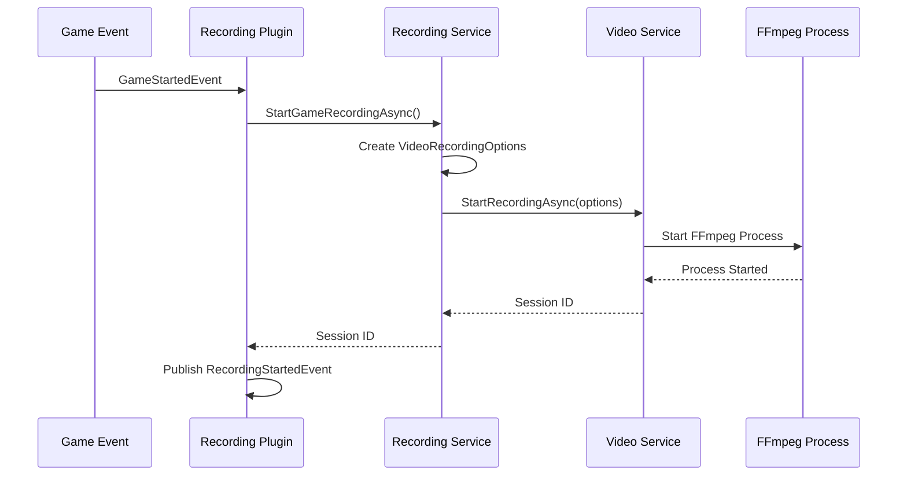
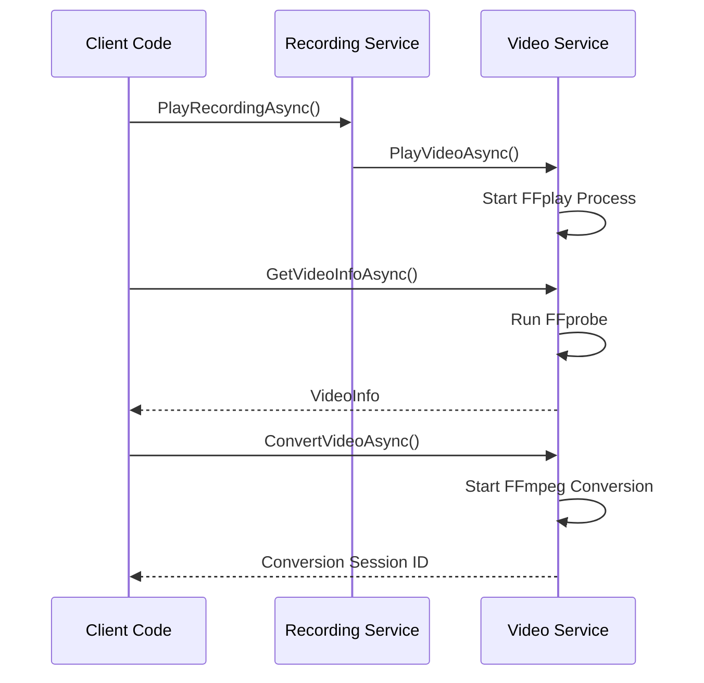

# Recording Service Architecture Comparison

## Overview

This document compares the new recording service architecture (using video service as dependency) with the previous direct FFmpeg implementation, highlighting the benefits of proper separation of concerns.

## Architecture Evolution

### Previous Approach: Direct FFmpeg Implementation

```
LablabBean.Plugins.Recording.FFmpeg
├── FFmpegVideoRecordingService
│   ├── Direct FFmpeg process management
│   ├── Platform-specific capture logic
│   ├── Video encoding configuration
│   └── Process monitoring and cleanup
├── VideoRecordingPlugin
│   ├── Game event integration
│   ├── Service registration
│   └── Recording lifecycle management
└── Configuration/FFmpegRecordingOptions
```

**Issues with Previous Approach:**

- **Tight coupling** between recording logic and video processing
- **Code duplication** when multiple plugins need video capabilities
- **Mixed responsibilities** in single service
- **Difficult to extend** with new video features
- **No reusability** of video processing logic

### New Approach: Layered Architecture with Dependency Injection

```
┌─────────────────────────────────────────────────────────────┐
│                    Application Layer                        │
├─────────────────────────────────────────────────────────────┤
│  LablabBean.Plugins.Recording.Video                        │
│  ├── VideoRecordingService (Recording Workflow)            │
│  ├── VideoRecordingPlugin (Game Integration)               │
│  └── Configuration/RecordingConfiguration                  │
├─────────────────────────────────────────────────────────────┤
│                    Service Layer                           │
├─────────────────────────────────────────────────────────────┤
│  LablabBean.Plugins.Video.FFmpeg                          │
│  ├── FFmpegVideoService (Video Processing)                │
│  ├── FFmpegVideoPlugin (Service Registration)             │
│  └── Video Operations (Record/Play/Convert/Analyze)       │
├─────────────────────────────────────────────────────────────┤
│                   Contract Layer                          │
├─────────────────────────────────────────────────────────────┤
│  LablabBean.Contracts.Video                               │
│  ├── IVideoService                                        │
│  ├── IVideoRecordingService                               │
│  ├── Models (VideoRecordingOptions, VideoInfo, etc.)     │
│  └── Events (VideoRecordingStartedEvent, etc.)           │
└─────────────────────────────────────────────────────────────┘
```

## Architectural Benefits

### 1. Separation of Concerns

**Recording Service Responsibilities:**

- Recording workflow management
- Game event integration
- Recording session tracking
- Recording-specific configuration
- Recording lifecycle events

**Video Service Responsibilities:**

- FFmpeg process management
- Video encoding/decoding
- Platform-specific video capture
- Video format conversion
- Video analysis and metadata

### 2. Dependency Injection Pattern

```csharp
// Recording service depends on video service
public class VideoRecordingService : IRecordingService
{
    private readonly IVideoRecordingService _videoRecordingService;
    private readonly IVideoService _videoService;

    public VideoRecordingService(
        ILogger logger,
        IVideoRecordingService videoRecordingService, // Injected dependency
        IVideoService videoService,                   // Injected dependency
        RecordingConfiguration? configuration = null)
    {
        // Recording service focuses on recording workflow
        // Video processing is delegated to video service
    }
}
```

**Benefits:**

- **Testability**: Easy to mock video service for unit testing
- **Flexibility**: Can swap video service implementations
- **Maintainability**: Changes to video processing don't affect recording logic
- **Reusability**: Video service can be used by other plugins

### 3. Interface Segregation

**Before (Monolithic Interface):**

```csharp
// Single service trying to do everything
public class FFmpegVideoRecordingService : IRecordingService, IService
{
    // Recording methods
    Task<string> StartRecordingAsync(...)
    Task StopRecordingAsync(...)

    // Video methods (mixed in)
    Task PlayRecordingAsync(...)

    // Action methods (compatibility)
    TResult ExecuteAction<TResult>(...)
}
```

**After (Segregated Interfaces):**

```csharp
// Video service - focused on video operations
public interface IVideoService
{
    Task<string> PlayVideoAsync(...)
    Task<VideoInfo> GetVideoInfoAsync(...)
    Task<string> ConvertVideoAsync(...)
}

public interface IVideoRecordingService
{
    Task<string> StartRecordingAsync(...)
    Task StopRecordingAsync(...)
    bool IsRecording(...)
}

// Recording service - focused on recording workflow
public interface IRecordingService
{
    Task<string> StartRecordingAsync(...)
    Task StopRecordingAsync(...)
    Task PlayRecordingAsync(...) // Delegates to video service
}
```

### 4. Configuration Separation

**Recording Configuration (Workflow-Focused):**

```csharp
public record RecordingConfiguration
{
    public GameRecordingOptions GameRecording { get; init; }     // Game-specific settings
    public ManualRecordingOptions ManualRecording { get; init; } // Manual recording settings
    public OutputSettings Output { get; init; }                 // File organization
    public AutoRecordingSettings AutoRecording { get; init; }   // Automation behavior
}
```

**Video Configuration (Technical-Focused):**

```csharp
public record VideoRecordingOptions
{
    public string VideoCodec { get; init; }      // Technical video settings
    public string Preset { get; init; }
    public int Quality { get; init; }
    public VideoRecordingSource Source { get; init; }
    public Dictionary<string, object> PlatformSettings { get; init; }
}
```

## Service Interaction Patterns

### Recording Workflow



### Video Operations



## Performance Comparison

### Resource Usage

**Previous Approach:**

- Each recording plugin creates its own FFmpeg processes
- Duplicate video processing logic across plugins
- No shared video service infrastructure
- Higher memory usage due to code duplication

**New Approach:**

- Single video service manages all FFmpeg processes
- Shared video processing infrastructure
- Recording service has minimal overhead
- Better resource utilization and process management

### Memory Footprint

```
Previous Architecture:
┌─────────────────────────┐
│ Recording Plugin A      │ ← FFmpeg Logic
│ ├── FFmpeg Process Mgmt │
│ ├── Video Encoding     │
│ └── Platform Capture   │
└─────────────────────────┘
┌─────────────────────────┐
│ Recording Plugin B      │ ← Duplicate FFmpeg Logic
│ ├── FFmpeg Process Mgmt │
│ ├── Video Encoding     │
│ └── Platform Capture   │
└─────────────────────────┘

New Architecture:
┌─────────────────────────┐
│ Recording Plugin A      │ ← Lightweight
│ └── Workflow Logic Only │
└─────────────────────────┘
┌─────────────────────────┐
│ Recording Plugin B      │ ← Lightweight
│ └── Workflow Logic Only │
└─────────────────────────┘
┌─────────────────────────┐
│ Video Service (Shared)  │ ← Single Instance
│ ├── FFmpeg Process Mgmt │
│ ├── Video Encoding     │
│ └── Platform Capture   │
└─────────────────────────┘
```

## Testing Benefits

### Unit Testing

**Previous Approach (Difficult to Test):**

```csharp
// Hard to test - tightly coupled to FFmpeg
public class FFmpegVideoRecordingServiceTests
{
    [Test]
    public async Task StartRecording_ShouldStartFFmpegProcess()
    {
        // Requires actual FFmpeg installation
        // Difficult to mock FFmpeg interactions
        // Tests are slow and brittle
    }
}
```

**New Approach (Easy to Test):**

```csharp
// Easy to test - dependencies can be mocked
public class VideoRecordingServiceTests
{
    [Test]
    public async Task StartRecording_ShouldDelegateToVideoService()
    {
        // Arrange
        var mockVideoService = new Mock<IVideoRecordingService>();
        var recordingService = new VideoRecordingService(logger, mockVideoService.Object, videoService, config);

        // Act
        await recordingService.StartRecordingAsync("output.mp4", "Test");

        // Assert
        mockVideoService.Verify(x => x.StartRecordingAsync(It.IsAny<string>(), It.IsAny<VideoRecordingOptions>(), It.IsAny<CancellationToken>()));
    }
}
```

### Integration Testing

**Layered Testing Strategy:**

```csharp
// Unit Tests: Recording service logic (mocked video service)
VideoRecordingServiceTests
├── Test recording workflow logic
├── Test configuration mapping
├── Test session management
└── Test event publishing

// Integration Tests: Video service functionality
FFmpegVideoServiceTests
├── Test actual FFmpeg integration
├── Test platform-specific capture
├── Test video processing operations
└── Test error handling

// End-to-End Tests: Full plugin integration
RecordingPluginIntegrationTests
├── Test game event integration
├── Test service registration
├── Test complete recording workflow
└── Test cross-plugin communication
```

## Migration Strategy

### Phase 1: Coexistence (Current State)

Both architectures can coexist:

- Old FFmpeg recording plugin continues working
- New video service + recording service provides enhanced capabilities
- Teams can choose which approach to use

### Phase 2: Migration

**For Existing Recording Code:**

```csharp
// Old approach
var recordingService = new FFmpegVideoRecordingService(logger, options);

// New approach - minimal changes required
var videoService = serviceRegistry.Get<IVideoService>();
var videoRecordingService = serviceRegistry.Get<IVideoRecordingService>();
var recordingService = new VideoRecordingService(logger, videoRecordingService, videoService, config);
```

**For New Features:**

- Use video service directly for video processing needs
- Use recording service for recording workflow needs
- Leverage both services for comprehensive video applications

### Phase 3: Consolidation

- Deprecate old FFmpeg recording plugin
- Migrate all recording functionality to new architecture
- Remove duplicate video processing code
- Standardize on layered architecture

## Extension Points

### Adding New Recording Types

**Old Approach (Difficult):**

```csharp
// Would need to modify FFmpegVideoRecordingService
// Add new recording logic mixed with existing code
// Risk breaking existing functionality
```

**New Approach (Easy):**

```csharp
// Extend recording service with new workflow
public class AdvancedRecordingService : VideoRecordingService
{
    public async Task<string> StartStreamingRecordingAsync(...)
    {
        // Use video service for actual recording
        // Add streaming-specific workflow logic
        return await _videoRecordingService.StartRecordingAsync(outputPath, streamingOptions);
    }
}
```

### Adding New Video Capabilities

**Old Approach (Requires Changes Everywhere):**

```csharp
// Would need to update every recording plugin
// Add video processing logic to each plugin
// Maintain consistency across plugins
```

**New Approach (Centralized):**

```csharp
// Add to video service - automatically available to all recording services
public class FFmpegVideoService : IVideoService, IVideoRecordingService
{
    public async Task<string> StartLiveStreamAsync(...)
    {
        // New video capability
        // Automatically available to all recording services
    }
}
```

## Conclusion

The new layered architecture with dependency injection provides significant benefits:

### **Immediate Benefits:**

- **Clean separation** of recording workflow and video processing
- **Better testability** through dependency injection
- **Reduced code duplication** via shared video service
- **Enhanced configurability** with separate recording and video settings

### **Long-term Benefits:**

- **Easier maintenance** with focused responsibilities
- **Better extensibility** through clear extension points
- **Improved performance** via shared video infrastructure
- **Greater flexibility** in choosing video implementations

### **Migration Path:**

- **Gradual adoption** - both approaches can coexist
- **Minimal breaking changes** - existing interfaces preserved
- **Enhanced capabilities** - new features available immediately
- **Future-proof architecture** - ready for additional video features

This architecture establishes a solid foundation for video-related functionality in Lablab Bean while maintaining backward compatibility and providing clear paths for future enhancements.
